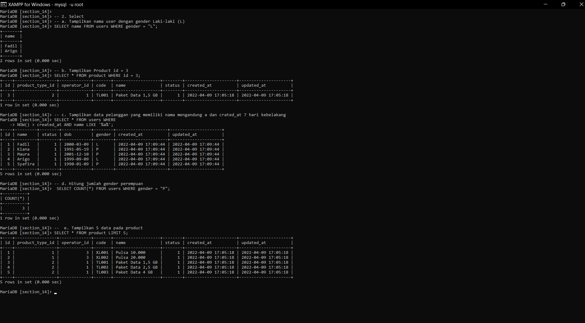
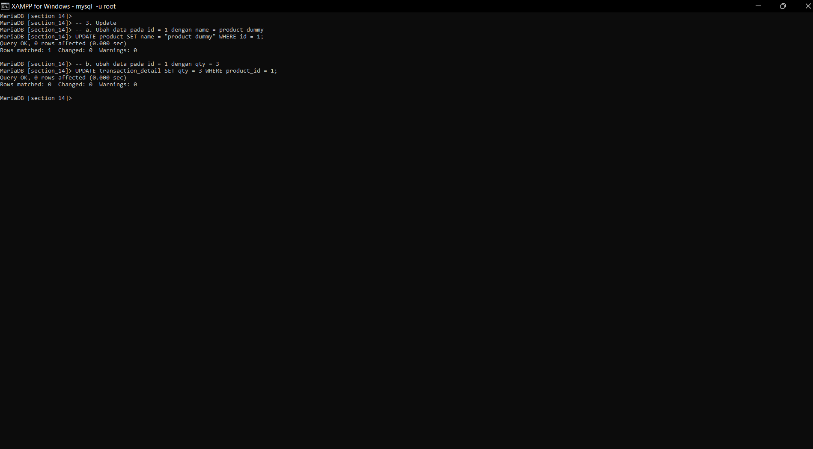

# Join - Union - Agregation - Sub Query - Function

## Join
Join merupakan menggabungkan dari 2 table atau lebih.
``` SELECT * FROM table1 JOIN table2 ON table1.table2_id = table2.id ```
## Union
Union itu sama seperti join hanya harus sama entitasnya. 


## Praktikum 

