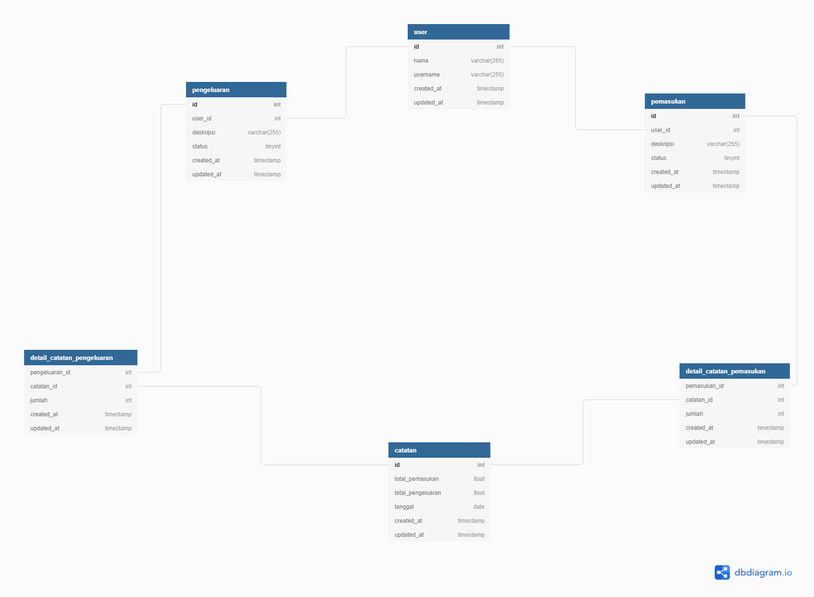
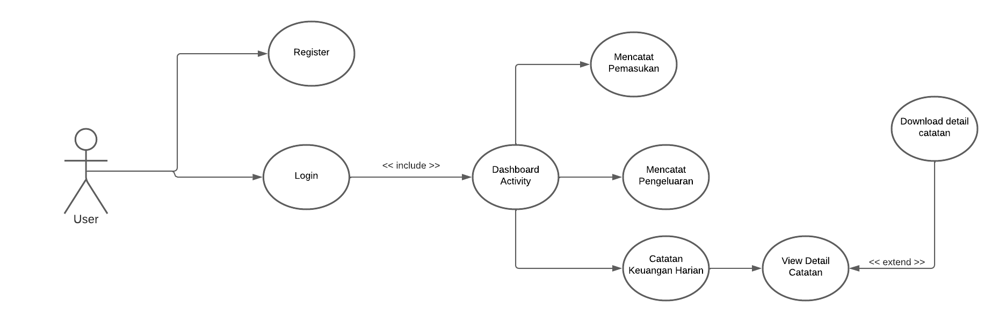

# System Design

## Pengertian System Design

> System Design merupakan pembuatan sebuah struktur dari sistem yang akan dibangun, contohnya relasi antar database ERD dan Workflow pada usecase

## ERD
ERD merupakan pembuatan sebuah relasi antar table, dimana setiap table memiliki alur dari table A ke table B dan ke table contohnya
contohnya 

## Use Case
Use case merupakan pembuatan sebuah alur user melakukan interaksi pada aplikasi kita sesuai feature pada aplikasi yang kita buatlah
contohnya

