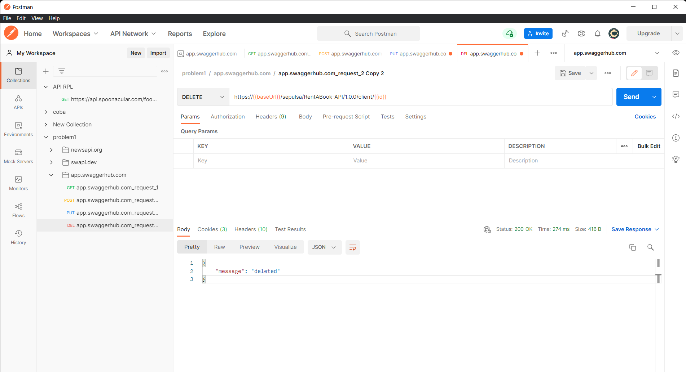

# Introduction Rest API 

## Apa itu API dan Rest-API ?
Api adalah sebuah kumpulan fungsi-fungsi dan Rest-API merupakan sebuah aturan untuk memanggil sebuah fungsi-fungsi dengan metode tertentu.

## Praktikun
Pada praktikum saya melakukan pengecekan menggunakan postman untuk memanggil api dengan aturan Rest
1. Newsapi
 
 
 
 
 

2. Swapi
  
  
  
  
  

3. Swagger
  
  
  
  