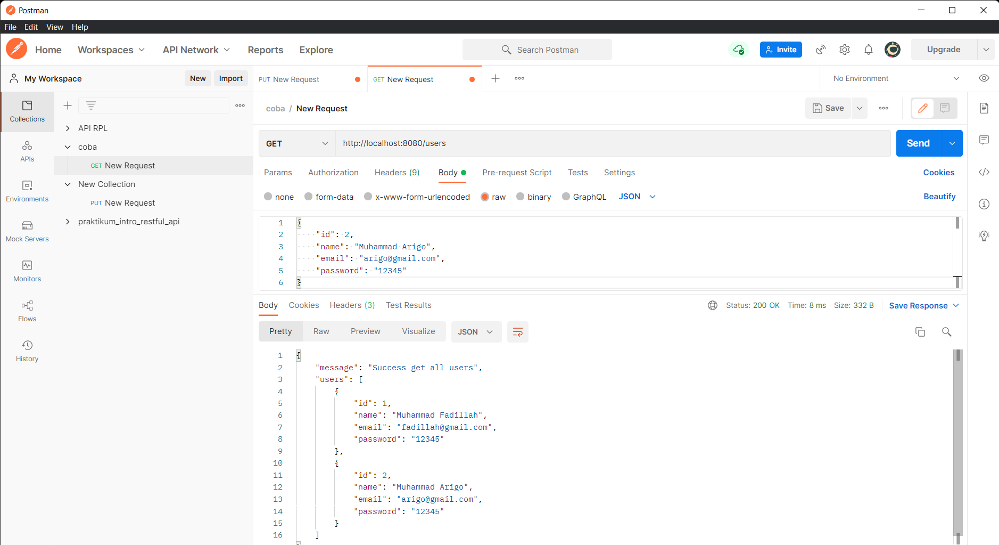
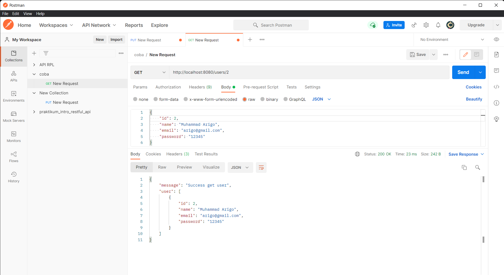
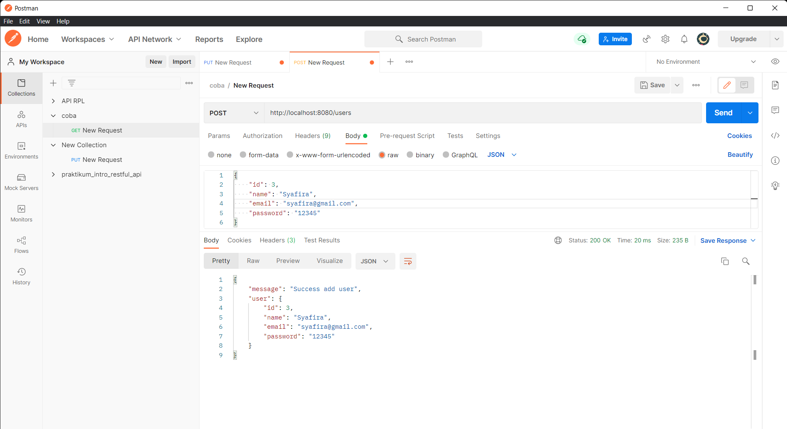
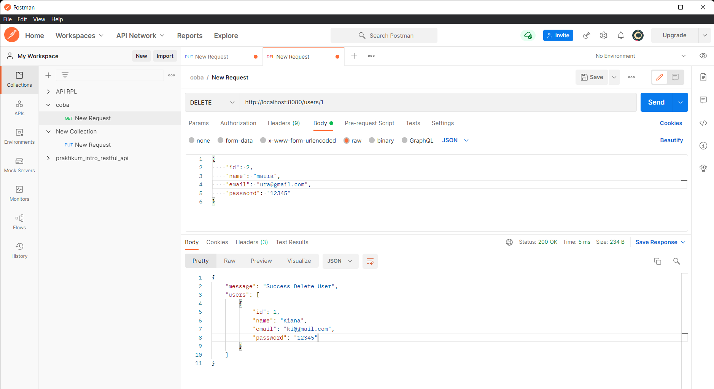

# intro echo golang

## Apa itu echo
Echo merupakan framework bahasa pemograman golang, disini service yang disajikan oleh echo ke http request yaitu kendali terhadap server yang nanti akan dibuat sebuah aturan rest api. Intinya echo mengendalikan lalulintas server go app kita.

## Praktikum echo
1. get all data
     
2. get by id
      
3. create data
      
4. update data
      
5. delete data
      