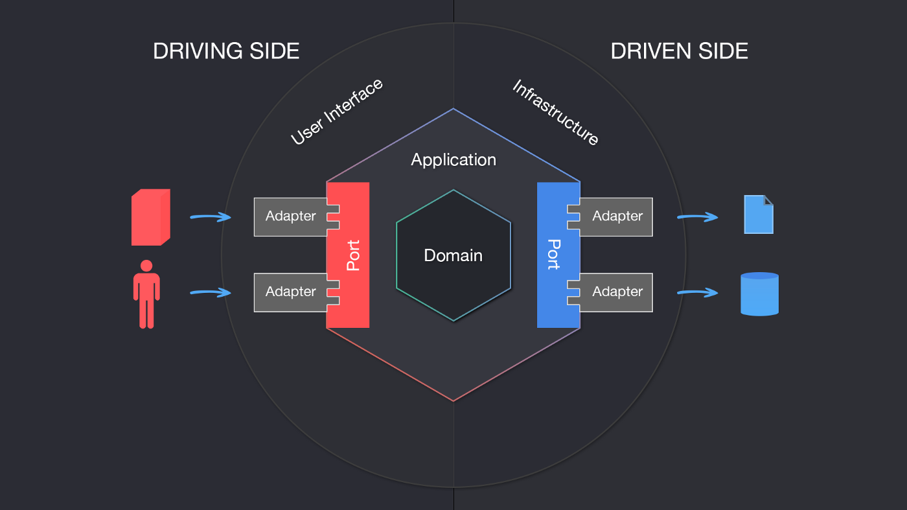

# Clean Arsitektur 

## Apa itu Clean Arsitektur
Clean Arsitektur merupakan struktur folder sebuah project seperti halnya MVC. Keunggulan Clean Arsitektur merupakan antar layernya modular sehingga mudah bila migrasi disalah satu layernya. Contohnya apabila suatu app ingin migrasi semua database nya menggunakan MongoDB maka yang diubah di sisi MongoDB saja tanpa menyentuh Servicenya atau Domainnya bahkan Handlernya. Intinya setiap layer dapat berdiri sendiri.

## Apa itu Hexagonal Arsitektur
Hexagonal Arsitektur Merupakan salah satu bentuk Clean Arsitektur, pada kasus nya setiap request client akan diterima dalam sebuah port yang akan diteruskan kedalam Domain. Setelah dari Domain diolah dan dikirim kan ke Repository atau bisa disebut penyimpanan Database

