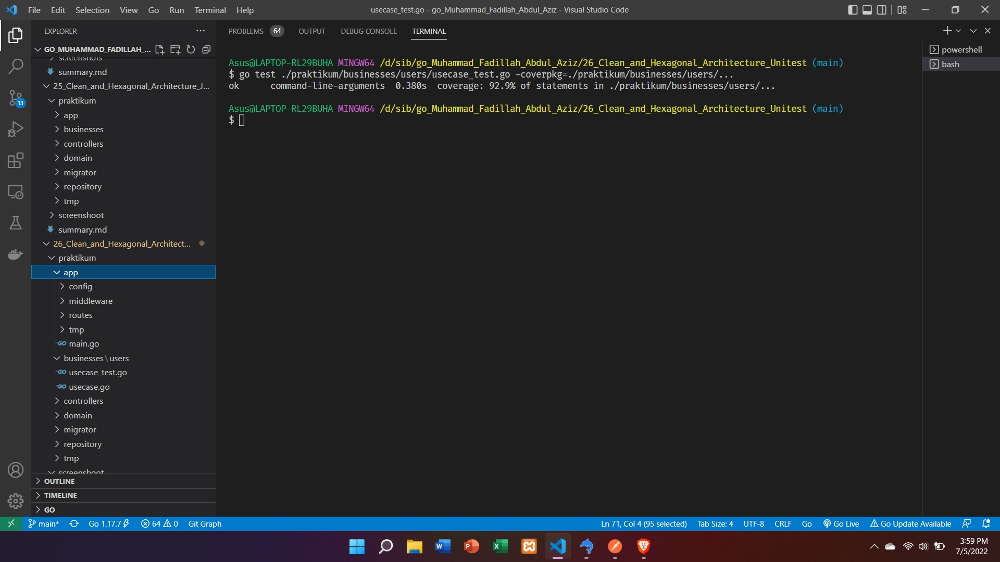

# Clean Architecture Unit Test
## apa itu unit test
unit test merupakan pengecekan logic sebuah function itu berkerja seperti yang diinginkan atau tidak, lalu dibuatkan coverage dari fungsi yang telah kita test.

## Mockery
Untuk unit test yang saya buat di clean architecture sedikit berbeda dengan yang MVC karena saya menggunakan Mockery. Jenis test nya pun berbeda karena di MVC saya menggunakan Integrated Testing.

## Hasil Coverage dari testing praktikum

