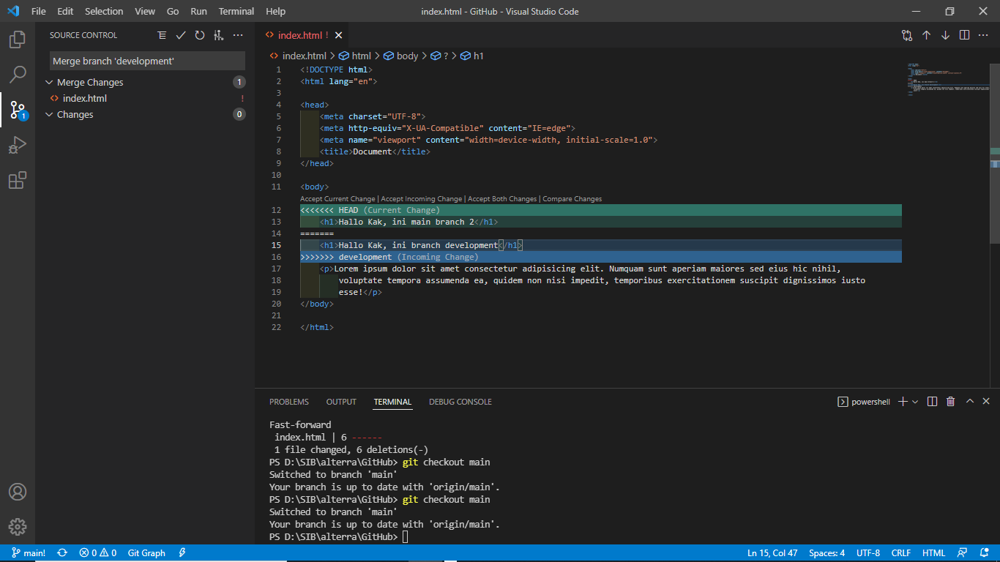

# Pratikum Github

disini kumpulan code dan foto hasil Screenshot penerapan pembelajaran section 2

* ## git clone
> ```git clone <clone-link> ```  clone repo github saya ke local <br /><br />


* ## git add / change stages 
> ```   git add . ``` Menambahkan file yang akan di ubah ke stage changes agar dapat dicommit dan dilanjut push origin / branch lainnya <br /><br />


* ## git commit
> ``` git commit -m "<message>" ``` Commit data dari changes stage <br /><br />


* ## git push
> ``` git push origin ```push dari branch local ke repository github <br /><br />


* ## git stash
> Memindahkan code yang saya buat <br /><br />


* ## git reset metode soft
> ``` git reset <kode version from log --oneline> --soft ``` memindahkan head ke commit versi tertentu <br /><br />


* ## git branch
> ``` git branch <nama-branch> ``` membuat branch pada local <br /><br />
 <br /><br />
> bila ingin memindahkan branch dari local ke repository tambah ``` git push -u origin <nama-branch> ```

* ## git conflict
> Contoh conflict saat pratikum 
 <br /><br />
> saya menggunakan github dekstop dan terdekteksi conflict seperti diatas. Dan saya solve this problem like video tutorial di LMS alta
 <br /><br />


