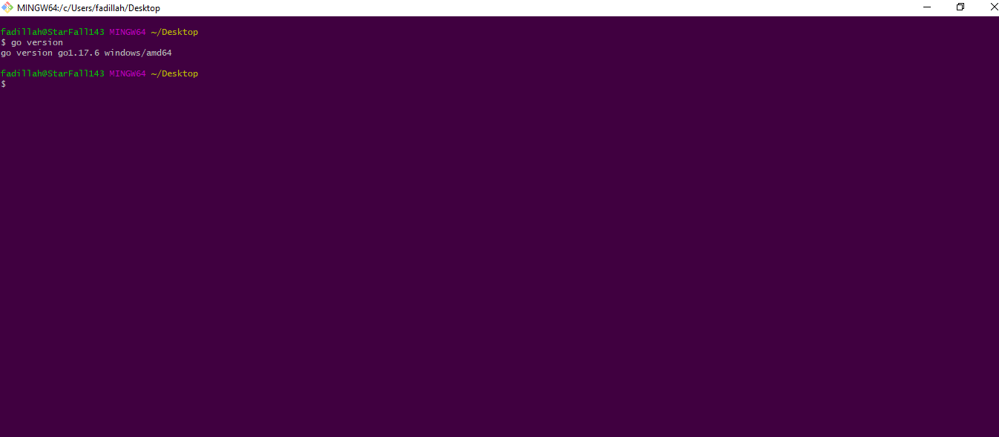
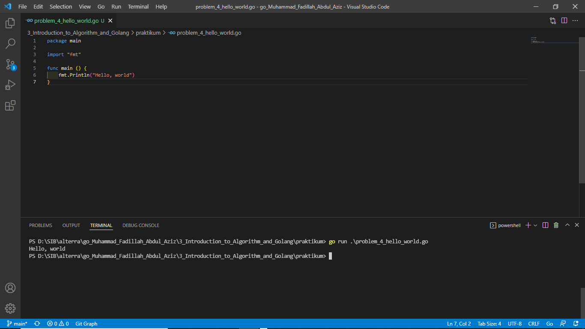
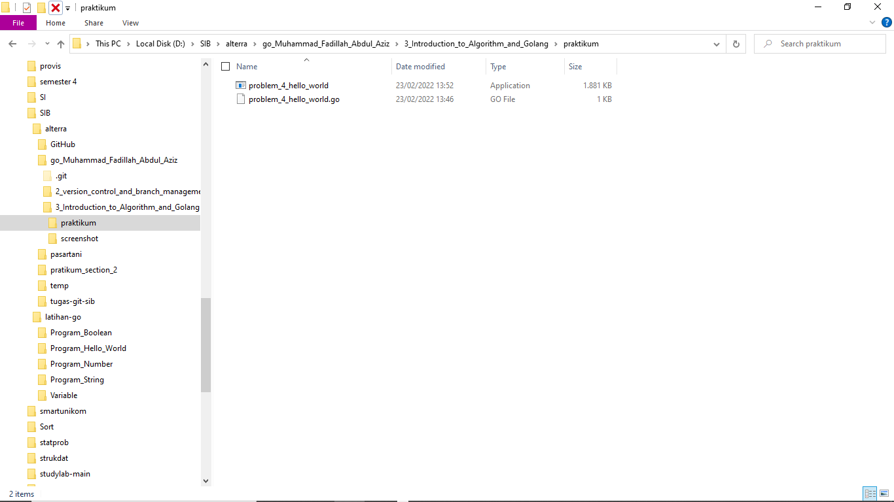

# Resume / Summary Introduction to Algorithm and Golang

## Algoritma
> Adalah prosedur komputasi yang didefinisikan dengan baik yang mengambl input dan memproses nilai menjadi sebuah input

## Karakteristik Algoritma
1. memiliki batas (awal dan akhir), Algoritma memiliki awal untuk memulai jalannya program dan akhiran sebagai tanda program itu selesai di eksekusi (bila tidak ada akhiran akan berdampak fatal)
2. Instruksi terdefinisikan dengan baik, instruksi disini dalam codingan. jangan membuat kata-kata asing, jadi buatlah intruksi secara umum.
3. Efektif dan Efisien, menurutku membuat algoritma diutamakan tidak membuat boros segi waktu, resource, syntaksis (walau mustahil untuk mendapat 3 kriteria tersebut)

## Konsep Dasar Algoritma
* Sequensial, secara berurut langkahnya sesuai tahapan, ibaratkan dari A sampai Z.
* Branching, terdapat percabangan untuk memilih sebuah kondisi True or False yang dapat menghasilkan output yang berbeda.
* Looping, melakukan perulangan untuk menyelesaikan suatu kondisi. 

## Pseudocode
> Merupakan baris program algoritma yang mirip seperti bahasa manusia. Berikut contoh yang saya aplikasikan sebuah pseudocoded mencari bilangan prima. <br/>
```
start

angka, i, m: Integer
hasil: String

angka := input
i := 0

for (m := 0, m < angka, m++) THEN
    if (angka % m == 0) THEN
        i ++
    end
    if (i == 2) THEN
        hasil := "bilangan prima"
    else 
        hasil := "bukan bilangan prima"
    end
end

print(hasil)

end
 ```

## Flowchart
> suatu bagan dengan simbol tertentu yang menggambarkan urutan dan hubungan antar proses secara detail.
<br/>
Contoh tugas flowchart yang saya kerjakan
<br/><br/>

* Flowchart bilangan prima


* Flowchart lampu dan tombol


## Tambahan hasil penyelesaian praktikum

### install go
> saya menginstall langsung golang exe version gol.17.6 dari go.dev
<br/>



### hello world
> me-run dan me-build problem_4_hello_world.go
<br/>

* setelah go run
 <br/><br/>
* setelah go build 

